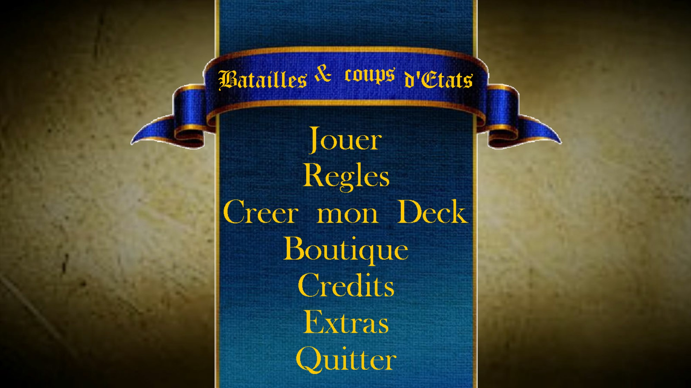

# Batailles-et-Coups-d'Etats

Projet du premier semestre de deuxième année à l'ECE en Informatique.

Jeu de cartes à jouer et collectionner inspiré de Pokémon en C++.

## A propos

Il s'agit d'un jeu de cartes à jouer et collectionner inspiré de Pokémon. Il est développé en **C++** avec la bibliothèque graphique primitive **Allegro**. Le thème général est celui de la guerre et de la politique. Les cartes sont des personnages historiques ou des armes. Le but du jeu est de battre son adversaire en lui infligeant le plus de dégâts possibles. Le jeu est jouable à deux joueurs sur un même ordinateur ou à un joueur contre l'ordinateur.

## Cahier des charges

### Extraits du cahier des charges

Le jeu qui vous est demandé s'inspire des jeux de cartes à jouer et collectionner type Pokémon. La description des règles qui suit est indicative. Il n'est pas évident qu'avec ces simplification le jeu soit encore passionnant. On pourrait le voir comme une sorte de Bataille (le jeu de carte) améliorée. Le but reste avant tout de pratiquer la programmation orientée objet en C++.

Chaque participant au jeu est enregistré avec son nom. Il possède une collection, un ensemble de cartes du jeu, en quantité indéfinie. Un deck est une sélection (sélection faite par le joueur) d'une quantité bien précise decartes (toujours la même) qui permet de jouer un match (faire une partie quoi) contre un autre joueur. Avant chaque match le joueur peut (re)faire un nouveau deck à partir de sa collection. Votre programme permet de créer de nouveaux joueurs, et de leur créer une collection de départ en choisissant parmi toutes les cartes du jeu (ces opérations se font dans l'interface du programme et ne nécessitent pas d'éditer du code ou un fichier). Votre programme organise une succession de matchs entre joueurs, l'interface permettant de choisir quels sont les joueurs qui vont s'affronter (faire le prochain match) et permettant à chacun de ces joueurs de successivement sélectionner leur deck à partir des cartes de leur collection qui est sauvée sur fichier (pas à retaper à chaque exécution). Ensuite la partie commence. Il y a 3 types de cartes : les cartes Energies, les cartes Créatures, les cartes Spéciales.

Les cartes créatures font des attaques directes, le jeu est une succession de duels entre créatures, les cartes énergies rendent possible les attaques (plus ou moins puissantes) des créatures, les cartes spéciales permettent au joueur d'altérer la mécanique par défaut du jeu, de « changer les règles », de créer des surprises, des retournements de situation... A chaque tour de jeu une nouvelle carte de la pioche est tirée. Le joueur peut décider de la jouer ou pas. Si la carte est jouée elle peut (dans le cas d'une carte créature ou spéciale persistante) remplacer la carte active correspondante (remplacer la créature en jeu ou la spéciale persistante). Les cartes refusées (non jouées) ainsi que les cartes remplacées peuvent repartir sous la pioche ou au sommet du cimetière, selon des règles explicites qui assurent un minimum d'intérêt au jeu mais garantissent des parties courtes (si possible 2 parties faisables en 12 minutes). Les cartes créatures tuées (points de vie à 0) vont au sommet du cimetière. Les points de dégât excédentaires vont se soustraire aux points de vie du joueur. Un joueur dont les points de vie arrivent à 0 a perdu. Quand le joueur dont c'est le tour de jeu n'a pas de créature posée (parce qu'elle vient de se faire tuer) il doit dérouler sa pioche (prendre au sommet, remettre dessous, sans jouer) jusqu'à en trouver une qu'il doit alors obligatoirement poser.

### Résumé du cahier des charges

- 4 domaines (types d'énergies...)
- 4 modèles de cartes énergie (une par domaine au moins)
- 5 modèles de cartes créatures avec chacune au moins 2 attaques
- 6 modèles de cartes spéciales permettant d'altérer les mécanismes par défaut du jeu
- Nombre indéfini de joueurs, pouvoir ajouter des joueurs...
- Pouvoir acheter des cartes pour faire évoluer les collections des joueurs
- Les données des joueurs et leur collection sont sauvées sur fichier (on les retrouve)
- Organiser des matchs entre joueurs au choix
- Phase de sélection des decks (à partir des collections de chacun)
- Battre le deck. Tirage de l'enjeu.
- Partie proprement dite jusqu'à perte d'un des 2 joueurs (ou match nul, exceptionnel)
- Le programme impose le respect des règles, détecte la fin de partie, ne plante pas
- Les cartes disent ce qu'elles font et font ce qu'elles disent (descriptions consultables)
- Attribution de la carte enjeu du perdant à la collection du gagnant
- Interface mode console pure, std::cout et std::cin, présentations séquentielles des infos

### Travail réalisé

Nous avons complété tous les points mentionnés dans le cahier des charges, les cartes Energies étant traduites par des cartes de Pouvoirs et les Créatures par des Dirigeants. Nous avons également ajouté des fonctionnalités supplémentaires :

- Système de comptes utilisateurs avec mot de passe
- Interface graphique intégrale, réalisée avec la bibliothèque graphique primitive **Allegro**
- Un système de création de cartes personnalisées
- Un calculateur de statistiques de victoire (meilleurs scores)

## Ce que nous avons appris

Nous avons pendant la réalisation de ce projet intégrallement appris la programmation graphique avec la bibliothèque Allegro. Ce projet nous a aussi permis d’appliquer de manière concrète les connaissances que nous avons acquises pendant ce semestre sur la programmation orientée objet.

## Installation

- [**CodeBlocks** 20.03](http://www.codeblocks.org/downloads/26)
- **Allegro** 4.4.3, [guide d'installation par M. Fercoq](https://fercoq.bitbucket.io/allegro/distribution/tuto_installer_allegro_64.pdf)

## Contributeurs

- Adrien Blair [@Ahddry](https://github.com/Ahddry)
- Aurélien Bon [@Aurelien-Bon](https://github.com/Aurelien-Bon)
- Cyril Haubois [@teepol](https://github.com/teepol)

## Copyright

Ce projet est sous licence MIT.

> Pour les étudiants, citez-nous si vous souhaitez réutiliser ce projet dans le cadre de vos propres travaux, ca vous évitera de vous faire prendre pour plagiat.
